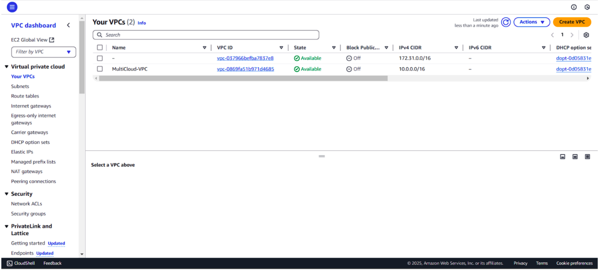
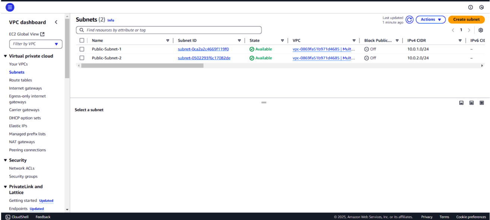
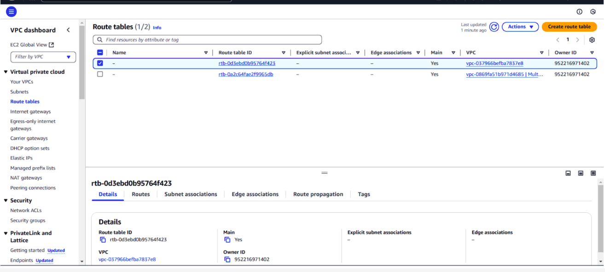
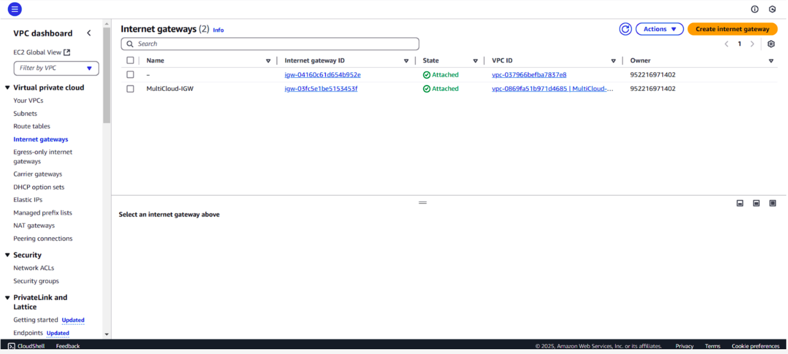
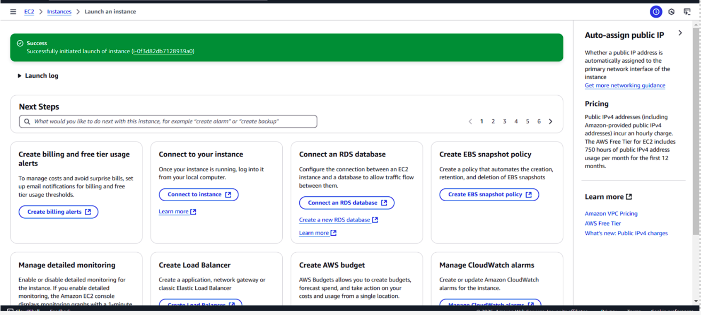
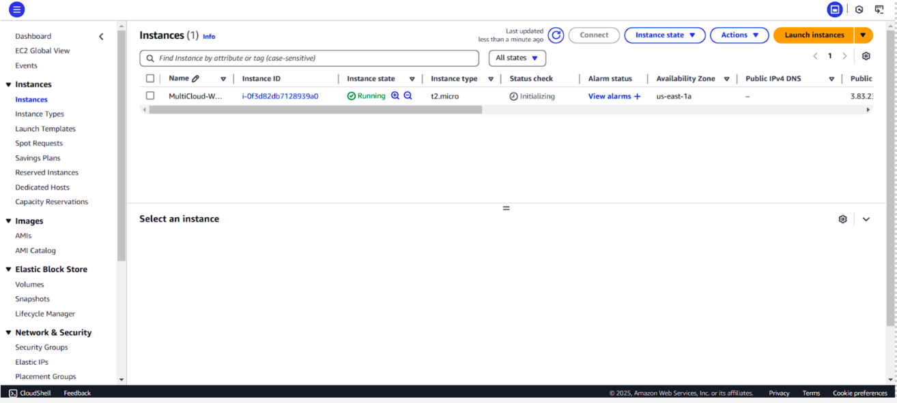
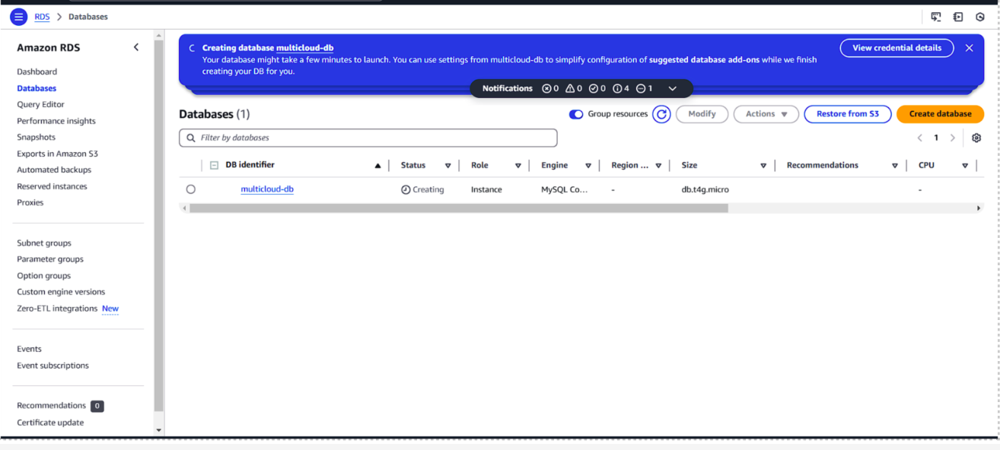
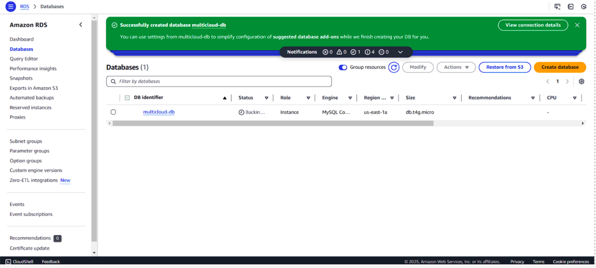

*COMPANY*: CODTECH IT SOLUTIONS

*NAME*: GANESH BANKURU

*INTERN ID*: CT06DF1421

*DOMANIN*: CLOUD COMPUTING

*DURATION*: 6 WEEKS

*MENTOR*: NEELA SANTOSH

TASK 3: Design a Multi-Cloud Architecture (AWS-Only Steps) 
Focus: Configure AWS services to enable interoperability with another cloud platform. 

Step-by-Step Guide 

Region: Use the default AWS region (e.g., us-east-1) and some times used (eu-north-1) for all steps. 

Step 1: Create a VPC for AWS Resources 

Objective: Design a secure network to host AWS services. 

Go to AWS Management Console > VPC Dashboard. 

Click Create VPC. 

Name: MultiCloud-VPC 

IPv4 CIDR: 10.0.0.0/16 

Leave other settings as default. 

Create Public Subnets: 

Subnet 1: 10.0.1.0/24 (Name: Public-Subnet-1, Availability Zone: us-east-1a) 

Subnet 2: 10.0.2.0/24 (Name: Public-Subnet-2, Availability Zone: us-east-1b) 

Attach an Internet Gateway: 

Create an Internet Gateway named MultiCloud-IGW and attach it to the VPC. 

Configure Route Tables: 

Edit the main route table to route 0.0.0.0/0 traffic to the Internet Gateway. 

Screenshot Heading: 
"Step 1: AWS VPC Configuration Showing Subnets and Internet Gateway" 
Where to Capture: VPC Dashboard showing the created VPC, subnets, and Internet Gateway. 

Step 2: Launch an EC2 Instance for Frontend Application 

Objective: Host a web server to interact with the other cloud platform. 

Go to EC2 Dashboard > Launch Instance. 

Configure: 

Name: MultiCloud-WebServer 

AMI: Amazon Linux 2023 

Instance Type: t2.micro 

Key Pair: Create/use an existing key pair. 

Network: Select MultiCloud-VPC and Public-Subnet-1. 

Auto-assign Public IP: Enable. 

Under Security Groups: 

Create a new security group: WebServer-SG 

Allow HTTP (Port 80), HTTPS (Port 443), and SSH (Port 22). 

Launch the instance. 

Screenshot Heading: 
"Step 2: EC2 Instance Launch Configuration with Public IP" 
Where to Capture: EC2 instance summary page showing the public IP and security group. 

Step 3: Set Up RDS MySQL Database 

Objective: Create a database accessible from both AWS and the other cloud. 

Go to RDS Dashboard > Create Database. 

Configure: 

Engine: MySQL 

Template: Free Tier 

DB Instance Identifier: multicloud-db 

Credentials: Set admin username/password. 

Network: Select MultiCloud-VPC and place the DB in Public-Subnet-2 (for demo purposes). 

Under Security Group, create a new SG: DB-SG 

Allow inbound traffic from WebServer-SG on Port 3306. 

Disable Public Access (for production, but enable temporarily for the demo). 

Screenshot Heading: 
"Step 3: RDS Database Configuration in Public Subnet" 
Where to Capture: RDS database connectivity & security tab showing the security group and subnet. 

Step 4: Configure IAM Roles for Cross-Cloud Access 

Objective: Grant EC2 permissions to access S3 (simulating cross-cloud storage). 

Go to IAM Dashboard > Roles > Create Role. 

Select AWS Service > EC2 > Next. 

Attach the AmazonS3FullAccess policy (for demo purposes). 

Name the role: EC2-S3-Access and create it. 

Attach the role to the MultiCloud-WebServer EC2 instance. 

Screenshot Heading: 
"Step 4: IAM Role with S3 Access Attached to EC2" 
Where to Capture: IAM role summary page showing the attached policies. 

Step 5: Deploy a Sample Web Application 

Objective: Test connectivity between EC2, RDS, and S3. 

SSH into the EC2 instance. 

Install Apache and PHP: 

bash 

Copy 

sudo yum install -y httpd php mysql 

sudo systemctl start httpd 

Create a PHP file (/var/www/html/index.php) to connect to RDS: 

php 

Copy 

<?php 

$servername = "<RDS_ENDPOINT>"; 

$username = "<DB_USER>"; 

$password = "<DB_PASSWORD>"; 

$conn = new mysqli($servername, $username, $password); 

if ($conn->connect_error) { 

  die("Connection failed: " . $conn->connect_error); 

} 

echo "Connected to RDS successfully!"; 

?> 

Test the page at http://<EC2_PUBLIC_IP>/index.php. 

Screenshot Heading: 
"Step 5: Web App Successfully Connecting to RDS" 
Where to Capture: Browser showing "Connected to RDS successfully!". 

Step 6: Simulate Cross-Cloud Interoperability with S3 

Objective: Use S3 as a mock service for the second cloud platform. 

Create an S3 bucket: 

Go to S3 Dashboard > Create Bucket > Name: multicloud-demo-bucket 

On the EC2 instance, use the AWS CLI to upload a test file: 

bash 

Copy 

echo "Multi-Cloud Demo" > test.txt 

aws s3 cp test.txt s3://multicloud-demo-bucket/ 

Screenshot Heading: 
"Step 6: File Uploaded to S3 from EC2 Instance" 
Where to Capture: S3 bucket contents showing the uploaded test.txt. 

Step 7: Document the Architecture 

Use AWS Architecture Tool or draw.io to create a diagram showing: 

EC2, RDS, S3, and VPC components. 

Label the other cloud platform as a placeholder (e.g., "External Cloud Provider"). 

Write a summary explaining how data flows between AWS and the other cloud. 

Screenshot Heading: 
"Step 7: Multi-Cloud Architecture Diagram" 
Where to Capture: Final architecture diagram with AWS and placeholder components. 

